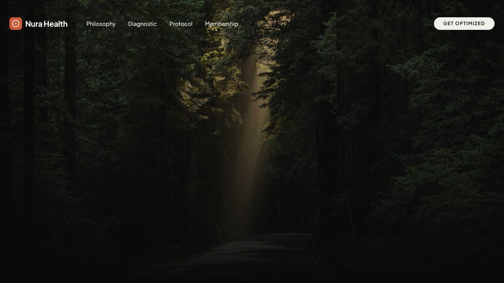
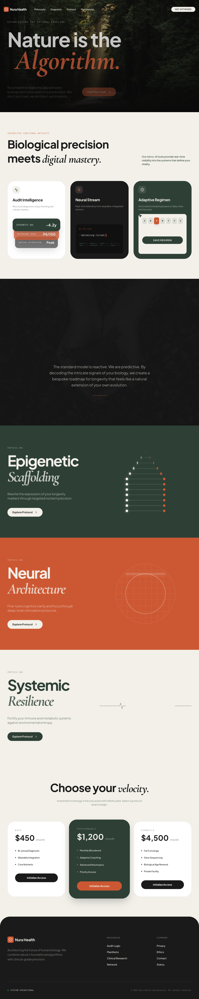

# Nura Health | Nature is the Algorithm

A high-fidelity, cinematic landing page for Nura Health. Bridging the gap between biological research and avant-garde luxury.



## Aesthetic Identity: "High-End Organic Tech"
- **Palette:** Moss (#2E4036), Clay (#CC5833), Cream (#F2F0E9), Charcoal (#1A1A1A).
- **Typography:** Plus Jakarta Sans & Outfit (Sans), Cormorant Garamond (Italic Serif), Fira Code (Mono).
- **Visuals:** Global Noise overlay, rounded-[3rem] radius system, motion-first architecture.

## Core Component Architecture

### A. The Floating Island (Navbar)
A fixed, pill-shaped container that transitions from transparent to a white/60 glassmorphic blur upon scroll.

### B. Interactive Functional Artifacts (Features)
- **Diagnostic Shuffler:** 3 overlapping cards cycling with spring-bounce transitions.
- **Neural Stream:** Live telemetry typewriter with a pulsing "Live Feed" indicator.
- **Adaptive Regimen:** Automated SVG cursor interaction with a weekly grid.

### C. Protocol (Sticky Stacking Archive)
Vertical stack of full-screen cards using GSAP ScrollTrigger. As a new card enters, the previous card scales down, blurs, and fades.
- **Artifacts:** Rotating double-helix, scanning laser-grid, and pulsing EKG waveform.

## Technical Implementation
- **Framework:** React 19
- **Styling:** Tailwind CSS v4
- **Animation:** GSAP 3 (ScrollTrigger)
- **Icons:** Lucide React

---

### Full Layout Preview


---

## Development
```bash
npm install
npm run dev
```
Open [http://localhost:5173](http://localhost:5173) to view.
